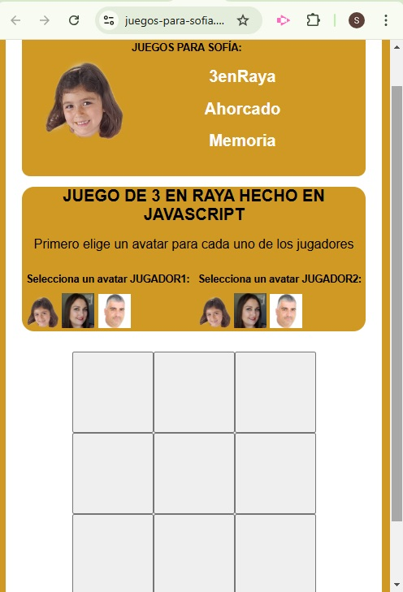
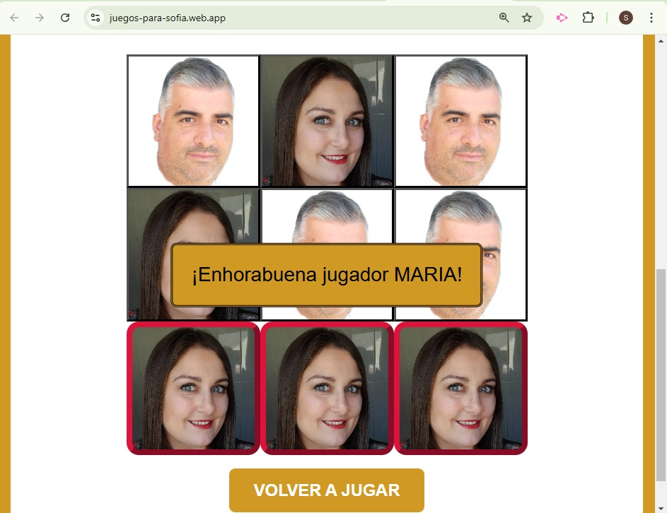
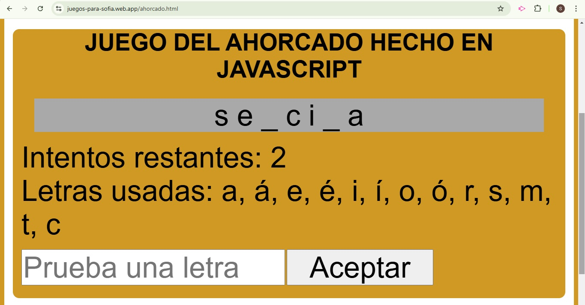
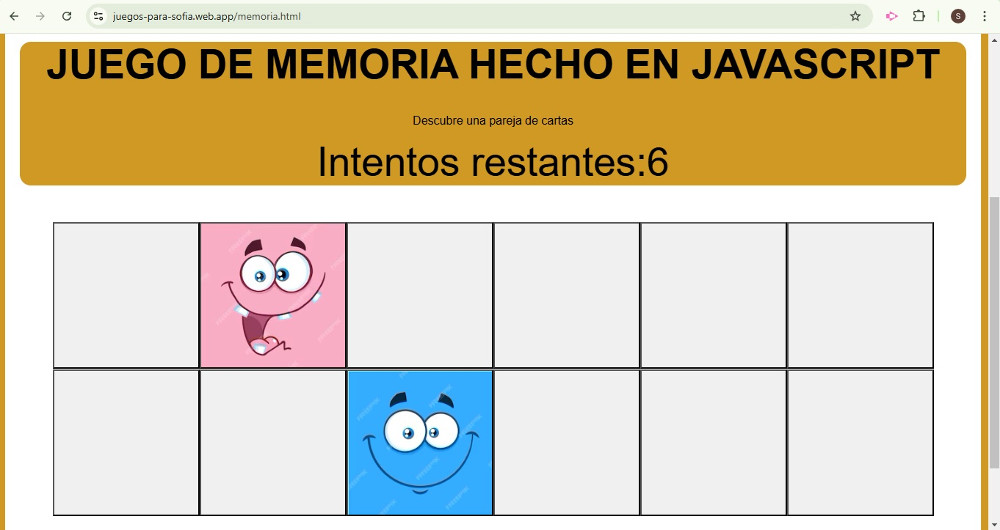



<h1 align="center">Web de Juegos en JavaScript</h1>

### Descripción General
Este proyecto consiste en el desarrollo de una página web interactiva que incluye tres juegos clásicos programados en JavaScript: Tres en Raya, Ahorcado, y Parejas de Memoria. El objetivo principal es repasar conocimientos de lenguajes de desarrollo web.

### Juegos Incluidos
- Tres en Raya
- Ahorcado:
- Parejas de Memoria

### Tecnologías Utilizadas

## Lenguajes:

- **HTML5:** Estructura de la página y elementos interactivos.
- **CSS3:** Estilo visual, diseño responsivo y animaciones.
- **JavaScript:** Lógica de los juegos, interacción del usuario y control de eventos.

### Conclusión
El proyecto combina juegos clásicos en una plataforma web moderna y accesible, ideal para entretener y practicar habilidades básicas de programación.

### Resumen pantallas WEB


 Pantalla 3enRaya



 Pantalla Ahoracdo



 Pantalla Memory

<h1 align="center">Web de Juegos en JavaScript</h1>

